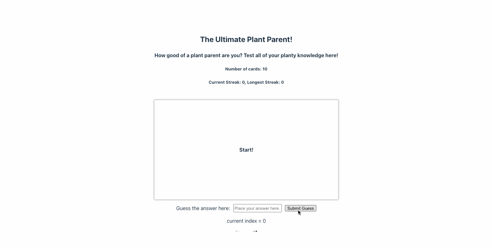

# Web Development Project 2 - *Name of App Here*

Submitted by: **Honghao Lin**

This web app: **Flashcards**

Time spent: **12** hours spent in total

## Required Features

The following **required** functionality is completed:

- [x] **The title of the card set and some information about it, such as a short description and the total number of cards are displayed**
- [x] **A single card at a time is displayed, only showing one of the components of the information pair**
- [x] **A list of card pairs is created**
- [x] **Clicking on the card shows the corresponding component of the information pair**
- [x] **Clicking the next button displays a random new card**

The following **optional** features are implemented:

- [x] Cards contains images in addition to or in place of text
- [ ] Cards have different visual styles such as color based on their category
  - [ ] *visual style implemented*

The following **additional** features are implemented:

* [ ] List anything else that you added to improve the site's functionality!

## Video Walkthrough

Here's a walkthrough of implemented required features:

<!-- Replace this with whatever GIF tool you used! -->
GIF created with LICEcap  
<!-- Recommended tools:
[Kap](https://getkap.co/) for macOS
[ScreenToGif](https://www.screentogif.com/) for Windows
[peek](https://github.com/phw/peek) for Linux. -->

## Notes

Describe any challenges encountered while building the app.

During the development progress, I notice that, when I click the next button, the flashcard is not going back to front page. I was having a hard
time trying to figure out the solution, because I treat FlashCard as a component embedded in the main page. When the button is clicked, I cannot 
do anything to the states of inner Flashcard component. But then, by scanning through the documentations, I find out that, I could actually create
states within main page, and pass the setter function to Flashcards instead of creating states in Flashcard, by doing so, I am able to set the flipped
state outside and inside the flashcard!

## License

    Copyright [2024] [Honghao Lin]

    Licensed under the Apache License, Version 2.0 (the "License");
    you may not use this file except in compliance with the License.
    You may obtain a copy of the License at

        http://www.apache.org/licenses/LICENSE-2.0

    Unless required by applicable law or agreed to in writing, software
    distributed under the License is distributed on an "AS IS" BASIS,
    WITHOUT WARRANTIES OR CONDITIONS OF ANY KIND, either express or implied.
    See the License for the specific language governing permissions and
    limitations under the License.